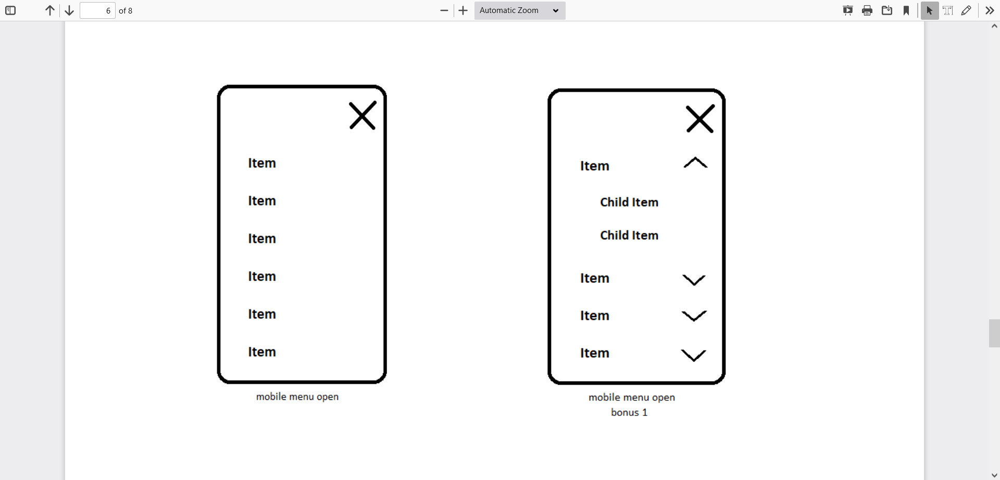

# Description

Create a header based on the HTML format given below. There is a separate mobile and
desktop view (HTML remains the same). Menu has to be sticky/fixed. In other words it anchors
at the browser’s upper edge when you scroll down. In the mobile view menu turns into a
hamburger button - opens onClick. Opened mobile menu is full height and slides in from the
side. If the mobile menu is open, the burger icon changes into X - closing icon.
Menu links in mobile view are located one under another. In desktop view menu links change
colour and background on hover. Logo is in the header. In the desktop view it is in the left corner
and in the mobile view it is centered.
Whole HTML content is placed into container. It’s max width is 1200px and is horizontally
centered.

## Bonus tasks - if the above is too easy':'

1) Menu links have sublinks, which in desktop view open on hover under the according
menu link (links are one under another). And in mobile view links expand. In other words
when you click on the button that appears beside the menu item, then it’s child links
open under the parent one (top to bottom).
2) Header has a content bar, which is shown above the menu (for instance
<https://www.apollo.ee/>). It means that the menu turns into sticky/fixed only, when you have
scrolled so far that the screen’s upper edge reaches the menu's upper edge. When you scroll
back up, fixed/sticky status disappears from the menu again, when the upper contect bar is
visible on the screen.

## Please use':'

HTML, CSS, JS. If you feel confident with using any other lightweight library, then
feel free to use it for a good reason.

## Format':'

Please send relevant HTML, CSS, JS, images and other necessary files needed for review and
testing in the local environment.

Used HTML format (HTML should contain this part):

``` HTML
<ul>
<li>
<a href="">Brushes</a>
</li>
<li>
<a href="">Buckets</a>
</li>
<li>
<a href="">Brooms</a>
</li>
<li>
<a href="">Poles</a>
</li>
<li>
<a href="">Vacuum cleaners</a>
</li>
<li>
<a href=""> Cleansers</a>
</li>
<li>
<a href="">Cleaning tools</a>
</li>
<li>
<a href="">DISCOUNT</a>
</li>
</ul>
```

## IF BONUS 1 IS DONE

``` HTML
<ul>
<li>
<a href=""> Brushes</a>
<ul>
<li>
<a href="">Child link</a>
<a href="">Child link</a>
<a href="">Child link</a>
</li>
</ul>
</li>
<li>
<a href="">Buckets</a>
<ul>
<li>
<a href="">Child link</a>
<a href="">Child link</a>
<a href="">Child link</a>
</li>
</ul>
</li>
<li>
<a href="">Brooms</a>
<ul>
<li>
<a href="">Child link</a>
<a href="">Child link</a>
<a href="">Child link</a>
</li>
</ul>
</li>
<li>
<a href="">Poles</a>
<ul>
<li>
<a href="">Child link</a>
<a href="">Child link</a>
<a href="">Child link</a>
</li>
</ul>
</li>
<li>
<a href="">Vacuum Cleaners</a>
<ul>
<li>
<a href="">Child link</a>
<a href="">Child link</a>
<a href="">Child link</a>
</li>
</ul>
</li>
<li>
<a href="">Cleansers</a>
<ul>
<li>
<a href="">Child link</a>
<a href="">Child link</a>
<a href="">Child link</a>
</li>
</ul>
</li>
<li>
<a href="">Cleaning tools</a>
<ul>
<li>
<a href="">Child link</a>
<a href="">Child link</a>
<a href="">Child link</a>
</li>
</ul>
</li>
<li>
<a href="">DISCOUNT</a>
<ul>
<li>
<a href="">Child link</a>
<a href="">Child link</a>
<a href="">Child link</a>
</li>
</ul>
</li>
</ul>
```

You can add classes, ID-s, links and other similar attributes to the HTML. The general structure
for the menu part should be as given above.Give body fixed height to make content scrollable. If
the menu does not fit well, apply a creative approach solving it.

### ILLUSTRATIVE PICTURES





